# School-District-Analysis

## Resources
Data Source: [schools_complete.csv](Resources/schools_complete.csv), [students_complete.csv](Resources/students_complete.csv)

Software: Anaconda 4.11.0, Python 3.7.11, MatPlotLib 3.5.0

## Overview
I was tasked with analyzing the school district data for look for trends in students' math and reading scores based on school size, school type (Charter or Public), per-student spending, and grade. After completing the initial analysis of the school district data I learned that the reading and math scores for 9th graders at Thomas High School have been altered and must not be considered in the data analysis.

### Process
The first step in the data analysis was to clean the data. The student data included some erroneous information such as "Mr." or "Dr." before a first name, or "DVM" or "PhD" after the last name. After importing the data, I iterated through the student names, looking for erroneous suffices and prefixes and replacing those with an empty string.

```python
# Add each prefix and suffix to remove to a list.
prefixes_suffixes = ["Dr. ", "Mr. ","Ms. ", "Mrs. ", "Miss ", " MD", " DDS", " DVM", " PhD"]

# Iterate through the words in the "prefixes_suffixes" list and replace them with an empty space, "".
for word in prefixes_suffixes:
    student_data_df["student_name"] = student_data_df["student_name"].str.replace(word,"")
```
Once that was complete, the next step was to remove the math and reading scores for 9th graders at Thomas High School and replace them with "NaN" so they will not be included in the district analysis.

```python
# Use the loc method on the student_data_df to select all the reading scores from the 9th grade at Thomas High School and replace them with NaN.
student_data_df.loc[(student_data_df["grade"]=="9th") & (student_data_df["school_name"]=="Thomas High School"),"reading_score"] = np.nan

#  Refactor the code in the above step to replace the math scores with NaN.
student_data_df.loc[(student_data_df["grade"]=="9th") & (student_data_df["school_name"]=="Thomas High School"),"math_score"] = np.nan
```
I next merged the student data and the school data into a dataframe that included all of the district data. The first 5 rows of the dataframe looked like this:

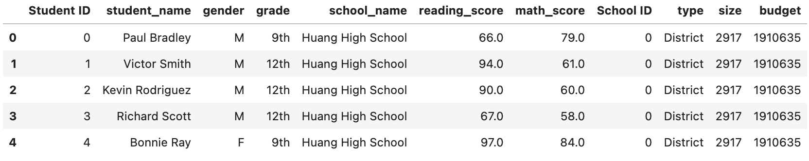

From this DataFrame I was able to calculate the number of 9th Graders at Thomas High School.

```python
thomas_ninth_grade_count = school_data_complete_df.loc[(school_data_complete_df["grade"] == "9th")&(school_data_complete_df["school_name"] == "Thomas High School")].count()
```
Count: 461

After subtracting the number of 9th graders at Thomas High School from the Total Student Count to get an updated total, I then calculated the district-wide percentages of students passing Math, Reading, and both along with average math and reading scores and additional information than can be seen in the School Summary Dataframes below.
##### Summary of School District Data Grouped by School
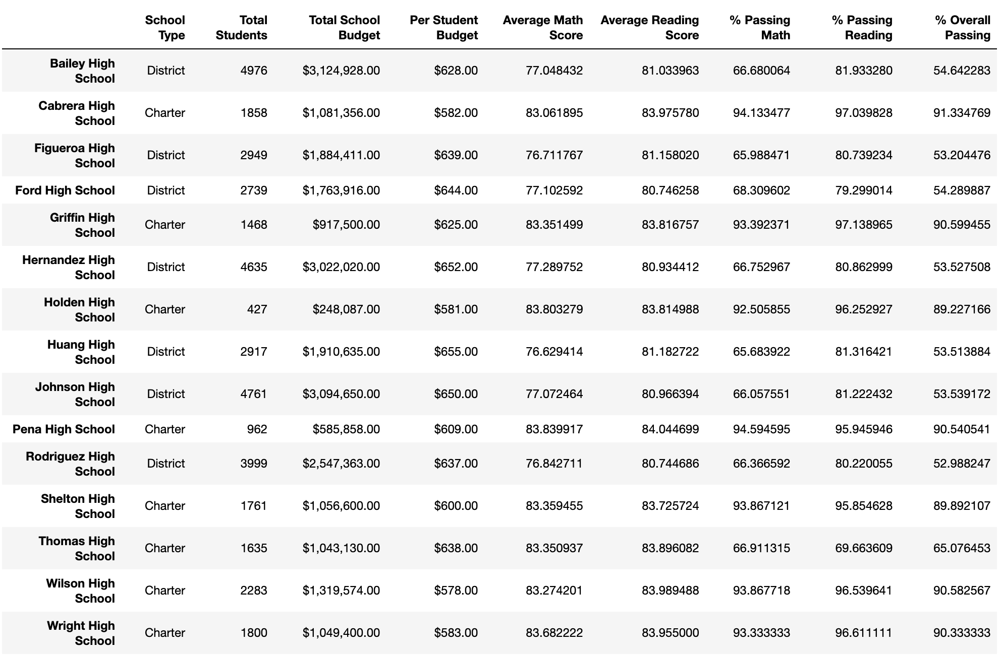

To get accurate data on passing rates for Thomas High School, I used a similar process to count the number of 10th-12th graders at Thomas High School and use that number as the total students at THS to calculate passing rates for the school. The reason for this was to ensure that the passing rates were not artificially lowered due to the removal of 461 math and reading test scores. Below is an example of the code used to calculate updated math passing rates. 

```python
# Get the number of 10th-12th graders from Thomas High School (THS).
ths_students_tenth_to_twelfth = per_school_summary_df.loc["Thomas High School", "Total Students"] - thomas_ninth_grade_count["Student ID"]

# Get all the students passing math from THS
ths_passing_math = school_data_complete_df.loc[(school_data_complete_df["math_score"]>= 70)&(school_data_complete_df["school_name"] == "Thomas High School")]

# Calculate the percentage of 10th-12th grade students passing math from Thomas High School. 
ths_passing_math_percentage = ths_passing_math["Student ID"].count()/ths_students_tenth_to_twelfth * 100
```

A similar method was used to calculate the percentage of students passing reading and passing overall.

Using the loc method I then passed those updated passing percentages back into the School Summary DataFrame to get an updated DataFrame.

##### School District Summary excluding 9th graders from THS in Passing Rates


From that point forward the school district analysis was straight forward. 

## Results

### How the change in data affected the school district metrics
- By removing the THS 9th graders' math and reading scores, the percent of all kids in the district passing math, passing reading, and the overall passing percentage was lowered by 0.2-0.3 percentage points. The following images show the district summary before and after removing the scores.
    -  #### District Summary DataFrame Including All Test Scores For All Students
        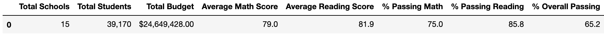
    -   #### District Summary DataFrame After Replacing Thomas High School 9th Graders' Scores with 'NaN'   
        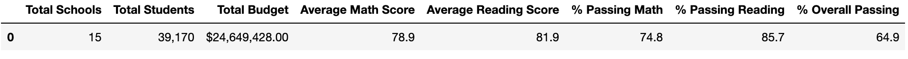

- The summary of passing rates per school was most affected initially. By comparing the two dataframes below you can see that the scores for Thomas High School were much lower after replacing the ninth graders' scores. The reason for this is there are 461 9th graders at THS out of the 1635 total students. Removing more than 25% of the scores without adjusting the number of total students will artifically lower the passing rates. 
    -   #### Per School Summary DataFrame Including All Test Scores For All Students
         
    -   #### Per School Summary DataFrame After Replacing Thomas High School 9th Graders' Scores with 'NaN'
         
    - In order to compensate for the removal of the 461 Thomas High School 9th Graders' scores, I re-calculated the passing rates from THS as described in the "Process" section above, and created a new School Summary Dataframe to more accurately reflect the data.
    -   #### Per School Summary Dataframe After Excluding 9th Graders' from THS in Student Count
           

- Replacing the math and reading scores with a NaN for 9th Graders at Thomas High School had a significant impact on the % of students passing math, reading, and passing overall. The percentage of students passing math, reading, or overall dropped between 25-28% as you can see in the following images.
    - #### Thomas High School Data Summary Including All Test Scores For All Students
        
    - #### Thomas High School Data Summary After Replacing Thomas High School 9th Graders' Scores with 'NaN'
             

- Replacing the 9th Grade THS scores with a NaN had the following effects on Math and Reading Scores and Passing Rates

    - There was no effect whatsoever to Math and Reading Scores by Grade except for 9th Graders at Thomas High School, as can be seen in the following images where "nan" is listed instead of a numeric score for 9th Graders at Thomas High School.
       - #### Math Scores by Grade Including All Test Scores For All Students
          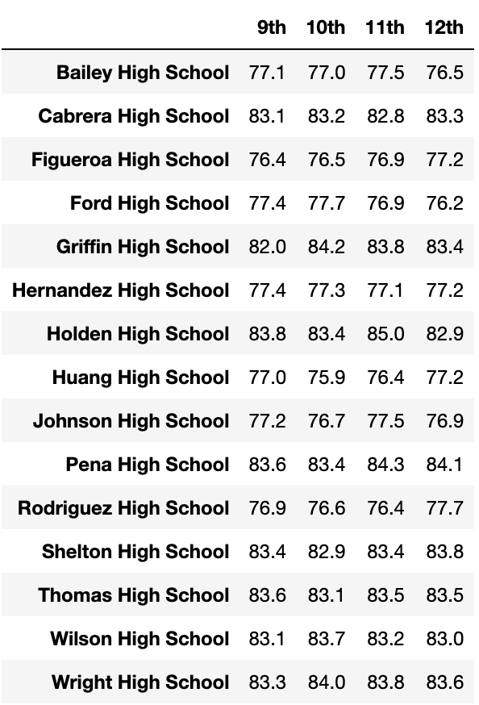 
      - #### Math Scores By Grade After Replacing Thomas High School 9th Graders' Scores with 'NaN'
          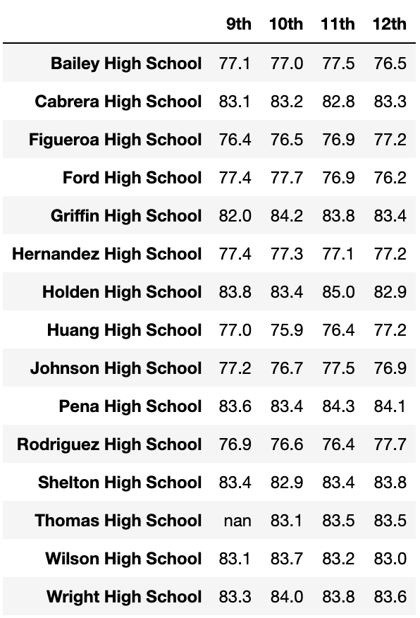
      - #### Reading Scores by Grade Including All Test Scores For All Students
           
       - #### Reading Scores By Grade After Replacing Thomas High School 9th Graders' Scores with 'NaN'
          
       
    - There was no significant effect on Averages Scores or Passing Rates based on school spending per capita as shown in the tables below. Thomas High School spends $638 per student so we would only expect to see a difference in the data in the $630-644 Spending Range. The numbers in the DataFrame are formatted to round to the nearest tenth in the case of scores and the nearest whole number in the case of passing rates. Replacing the THS 9th Graders' test scores with 'NaN' had a smaller than 0.1 and 1% effect on final numbers, respectively.
        - #### Spending Summary DataFrame Including All Test Scores For All Students
            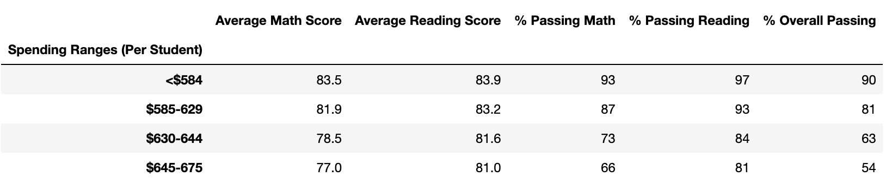 
        - #### Spending Summary DataFrame After Replacing Thomas High School 9th Graders' Scores with 'NaN'
              
         
    - There was no significant effect on Average Scores or Passing Rates based on school size as shown in the tables below. The numbers in the DataFrame are formatted to round to the nearest tenth in the case of scores and the nearest whole number in the case of passing rate. Thus, replacing the THS 9th Graders' test scores with 'NaN' affected the scores and passing rates by less than 0.1 and 1%, respectively. Furthermore, Thomas High School has 1635 students, so we would only expect to see a change for Medium (1000-1999) Schools, if any.
        -   #### Per School Size Summary DataFrame Including All Test Scores For All Students
              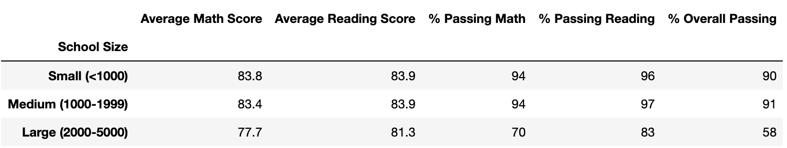
        -   #### Per School Size Summary DataFrame After Replacing Thomas High School 9th Graders' Scores with 'NaN'
              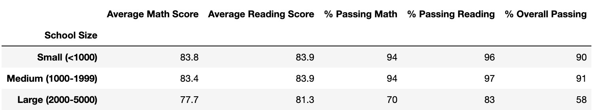
  
     - There was no significant effect on Averages Scores or Passing Rates based on school type as shown in the tables below. Thomas High School is a charter school so we would only expect to see a difference in the data for Charter Schools. The numbers in the DataFrame are formatted to round to the nearest tenth in the case of scores and the nearest whole number in the case of passing rates. Replacing the THS 9th Graders' test scores with 'NaN' had a smaller than 0.1 and 1% effect on final numbers, respectively.
        - #### School Type Summary DataFrame Including All Test Scores For All Students
            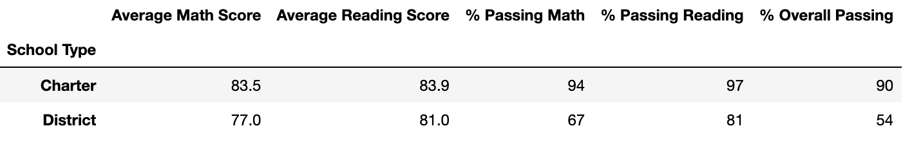 
        - #### School Type Summary DataFrame After Replacing Thomas High School 9th Graders' Scores with 'NaN'
             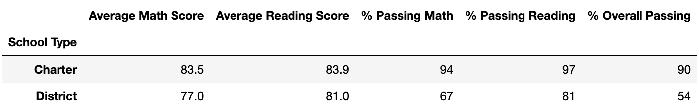 

## Summary

'Summarize four changes in the updated school district analysis after reading and math scores for the ninth grade at Thomas High School have been replaced with NaNs.

### Summary of change in analysis
- Include a statement summarizing four changes to the school district analysis after reading and math scores have been replaced
